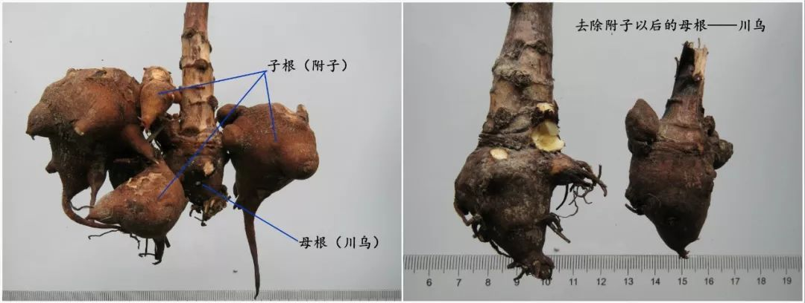

# 前言
现在中国出的《中国药典》这一本书，我只能说还不如不出呢，危害将是巨大。到宋代之后中医已经变了味。 唐朝之前注重”数“， 宋之后侧重点变成"术"，本末倒置了。
药典： 你规定药说明剂量，将失去药性内在乾坤。   

# 附子和川乌
生长习性：
| 环境因素   | 具体要求                       | 说明                           |
| ------ | -------------------------- | ---------------------------- |
| **温度** | 耐寒性强，喜凉爽湿润                 | 适应海拔200-2200米，年平均气温-3°C~15°C |
| **光照** | 喜阳光充足，耐半阴                  | 夏季需避免强光直射，忌高温酷暑              |
| **湿度** | 喜湿润环境，土壤 moisture >87.34mm | 生长前期喜水，7-8月忌水涝               |
| **海拔** | 200-2200米均可栽培              | 四川江油道地产区海拔450-600米           |

**禁忌土壤:**
粘土、重黏土（易积水烂根）
盐碱地
前茬为豆科、茄科作物的地块（忌连作）

乌头和附子 图片

***关键特点：乌头是"喜水又怕水"的植物——冬春需保持土壤湿润，夏季田间绝不能积水***

## 乌头与附子的采收时间线
| 时间             | 操作           | 说明                              |
| -------------- | ------------ | ------------------------------- |
| **冬季（11-12月）** | 种植乌头块根       | 将乌头种入土中                         |
| **次年春季（3-4月）** | 发芽生长         | 苗高约1尺时施肥、打顶、修剪                  |
| **次年夏季（6-8月）** | **采收附子（子根）** | 此时子根已成熟，挖出后母根和子根分开处理            |
| **若留种**        | 母根继续生长       | 经过冬季，到**第三年早春**发芽前采收 → 成为**川乌** |

## 药性说明
| 药材         | 性味     | 主要功效      | 应用侧重      |
| ---------- | ------ | --------- | --------- |
| **川乌**（母根） | 辛、苦，热  | 祛风除湿、温经止痛 | 风寒湿痹、关节疼痛 |
| **附子**（子根） | 辛、甘，大热 | 回阳救逆、补火助阳 | 亡阳虚脱、心肾阳虚 |

### 川乌
| 项目       | 要求                           |
| -------- | ---------------------------- |
| **内服剂量** | 炮制后1.5-9克（制川乌3-6克，制草乌1.5-3克） |
| **煎煮方法** | **必须先煎30-60分钟**，久煎以降低毒性      |
| **外用**   | 适量，研末调敷或煎汤熏洗                 |
| **配伍禁忌** | 避免与半夏、瓜蒌、贝母、白蔹、白及等同用         |

### 附子
| 用法       | 剂量        | 备注           |
| -------- | --------- | ------------ |
| **常规剂量** | **3-15克** | 炮制后用（制附子）    |
| **回阳救逆** | 15-30克    | 急重症，需久煎1-2小时 |
| **最大剂量** | 不超过30克    | 需医师处方，严格监护   |
| **外用**   | 适量        | 研末调敷或煎水熏洗    |

***附子分： 生附子 炮附子 盐附子***
| 炮制品     | 炮制方法       | 毒性     | 功效特点      | 主要用途            |
| ------- | ---------- | ------ | --------- | --------------- |
| **生附子** | 鲜品洗净，不经炮制  | **大毒** | 助心肾阳 | **内服主药**，回阳救逆    |
| **炮附子** | 砂烫、火炮或姜汁制  | 毒性降低   | 回阳救逆，温补脾肾 | **内服主药**，回阳救逆   |
| **盐附子** | 胆巴水+食盐浸泡煮制 | 毒性大减   | 补肾助阳，固精缩尿 | 走下焦 |

盐附子不可以经过胆巴水浸泡  将失去药性价值。  市面买的炮附子和盐附子 自己都买过  使用的剂量60g 煮1个小时 都已经没有药性了 就是个药渣子。

***中毒症状：口舌麻木、心悸、呕吐、心律失常、呼吸麻痹***
